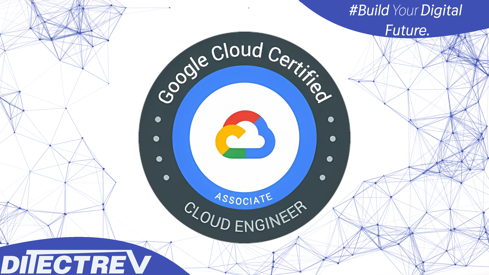

# ⬆️ Google Cloud Platform (GCP) Associate Cloud Engineer Practice Tests Exams Questions Answers

## Table of Contents

| No. | Questions |
| --- | --------------------------- |
| 1   | [You significantly changed a complex Deployment Manager template and want to confirm that the dependencies of all defined resources are properly met before committing it to the project. You want the most rapid feedback on your changes. What should you do?](#you-significantly-changed-a-complex-deployment-manager-template-and-want-to-confirm-that-the-dependencies-of-all-defined-resources-are-properly-met-before-committing-it-to-the-project-you-want-the-most-rapid-feedback-on-your-changes-what-should-you-do) |
| 2   | [Your company has a 3-tier solution running on Compute Engine. The configuration of the current infrastructure is shown below. Each tier has a service account that is associated with all instances within it. You need to enable communication on TCP port 8080 between tiers as follows: Instances in tier #1 must communicate with tier #2. Instances in tier #2 must communicate with tier #3. What should you do?](#your-company-has-a-3-tier-solution-running-on-compute-engine-the-configuration-of-the-current-infrastructure-is-shown-below-each-tier-has-a-service-account-that-is-associated-with-all-instances-within-it-you-need-to-enable-communication-on-tcp-port-8080-between-tiers-as-follows-what-should-you-do) |
| 3   | [You are analyzing Google Cloud Platform service costs from three separate projects. You want to use this information to create service cost estimates by service type, daily and monthly, for the next six months using standard query syntax. What should you do?](#you-are-analyzing-google-cloud-platform-service-costs-from-three-separate-projects-you-want-to-use-this-information-to-create-service-cost-estimates-by-service-type-daily-and-monthly-for-the-next-six-months-using-standard-query-syntax-what-should-you-do) |
| 4   | [You want to send and consume Cloud Pub/Sub messages from your App Engine application. The Cloud Pub/Sub API is currently disabled. You will use a service account to authenticate your application to the API. You want to make sure your application can use Cloud Pub/Sub. What should you do?](#you-want-to-send-and-consume-cloud-pub/sub-messages-from-your-app-engine-application-the-cloud-pub-sub-api-is-currently-disabled-you-will-use-a-service-account-to-authenticate-your-application-to-the-api-you-want-to-make-sure-your-application-can-use-cloud-pub-sub-what-should-you-do) |
| 5   | [You have a website hosted on App Engine standard environment. You want 1% of your users to see a new test version of the website. You want to minimize complexity.](#you-have-a-website-hosted-on-app-engine-standard-environment-you-want-1%-of-your-users-to-see-a-new-test-version-of-the-website-you-want-to-minimize-complexity) |
| 6   | [Your organization is a financial company that needs to store audit log files for 3 years. Your organization has hundreds of Google Cloud projects. You need to implement a cost-effective approach for log file retention.](#your-organization-is-a-financial-company-that-needs-to-store-audit-log-files-for-3-years-your-organization-has-hundreds-of-google-cloud-projects-you-need-to-implement-a-cost-effective-approach-for-log-file-retention) |
| 7   | [You built an application on Google Cloud that uses Cloud Spanner. Your support team needs to monitor the environment but should not have access to table data. You need a streamlined solution to grant the correct permissions to your support team, and you want to follow Google-recommended practices. What should you do?](#you-built-an-application-on-google-cloud-that-uses-cloud-spanner-your-support-team-needs-to-monitor-the-environment-but-should-not-have-access-to-table-data-you-need-a-streamlined-solution-to-grant-the-correct-permissions-to-your-support-team-and-you-want-to-follow-google-recommended-practices-what-should-you-do?) |
| 8   | [You want to run a single caching HTTP reverse proxy on GCP for a latency-sensitive website. This specific reverse proxy consumes almost no CPU. You want to have a 30-GB in-memory cache, and need an additional 2 GB of memory for the rest of the processes. You want to minimize cost. How should you run this reverse proxy?](#you-want-to-run-a-single-caching-http-reverse-proxy-on-gcp-for-a-latency-sensitive-website-this-specific-reverse-proxy-consumes-almost-no-cpu-you-want-to-have-a-30-gb-in-memory-cache-and-need-an-additional-2-gb-of-memory-for-the-rest-of-the-processes-you-want-to-minimize-cost-how-should-you-run-this-reverse-proxy) |
| 9   | [You have a single binary application that you want to run on Google Cloud Platform. You decided to automatically scale the application based on underlying infrastructure CPU usage. Your organizational policies require you to use virtual machines directly. You need to ensure that the application scaling is operationally efficient and completed as quickly as possible. What should you do?](#you-have-a-single-binary-application-that-you-want-to-run-on-google-cloud-platform-you-decided-to-automatically-scale-the-application-based-on-underlying-infrastructure-cpu-usage-your-organizational-policies-require-you-to-use-virtual-machines-directly-you-need-to-ensure-that-the-application-scaling-is-operationally-efficient-and-completed-as-quickly-as-possible-what-should-you-do?) |
| 10   | [You need to set up permissions for a set of Compute Engine instances to enable them to write data into a particular Cloud Storage bucket. You want to follow Google-recommended practices. What should you do?](#you-need-to-set-up-permissions-for-a-set-of-compute-engine-instances-to-enable-them-to-write-data-into-a-particular-cloud-storage-bucket-you-want-to-follow-google-recommended-practices-what-should-you-do?) |
| 11   | [You have an object in a Cloud Storage bucket that you want to share with an external company. The object contains sensitive data. You want access to the content to be removed after four hours. The external company does not have a Google account to which you can grant specific user-based access privileges. You want to use the most secure method that requires the fewest steps. What should you do?](#you-have-an-object-in-a-cloud-storage-bucket-that-you-want-to-share-with-an-external-company-the-object-contains-sensitive-data-you-want-access-to-the-content-to-be-removed-after-four-hours-the-external-company-does-not-have-a-google-account-to-which-you-can-grant-specific-user-based-access-privileges-you-want-to-use-the-most-secure-method-that-requires-the-fewest-steps-what-should-you-do) |
| 12   | [You need to create an autoscaling managed instance group for an HTTPS web application. You want to make sure that unhealthy VMs are recreated. What should you do?](#you-need-to-create-an-autoscaling-managed-instance-group-for-an-https-web-application-you-want-to-make-sure-that-unhealthy-vms-are-recreated-what-should-you-do) |
| 13   | [You are deploying an application to a Compute Engine VM in a managed instance group. The application must be running at all times, but only a single instance of the VM should run per GCP project. How should you configure the instance group?](#you-are-deploying-an-application-to-a-compute-engine-vm-in-a-managed-instance-group-the-application-must-be-running-at-all-times-but-only-a-single-instance-of-the-vm-should-run-per-gcp-project-how-should-you-configure-the-instance-group) |
| 14   | [You have production and test workloads that you want to deploy on Compute Engine. Production VMs need to be in a different subnet than the test VMs. All the VMs must be able to reach each other over internal IP without creating additional routes. You need to set up VPC and the 2 subnets. Which configuration meets these requirements?](#you-have-production-and-test-workloads-that-you-want-to-deploy-on-compute-engine-production-vms-need-to-be-in-a-different-subnet-than-the-test-vms-all-the-vms-must-be-able-to-reach-each-other-over-internal-ip-without-creating-additional-routes-you-need-to-set-up-vpc-and-the-2-subnets-which-configuration-meets-these-requirements) |
| 15   | [You have an instance group that you want to load balance. You want the load balancer to terminate the client SSL session. The instance group is used to serve a public web application over HTTPS. You want to follow Google-recommended practices. What should you do?](#you-have-an-instance-group-that-you-want-to-load-balance-you-want-the-load-balancer-to-terminate-the-client-ssl-session-the-instance-group-is-used-to-serve-a-public-web-application-over-https-you-want-to-follow-google-recommended-practices-what-should-you-do) |
| 16   | [You have a web application deployed as a managed instance group. You have a new version of the application to gradually deploy. Your web application is currently receiving live web traffic. You want to ensure that the available capacity does not decrease during the deployment. What should you do?](#you-have-a-web-application-deployed-as-a-managed-instance-group-you-have-a-new-version-of-the-application-to-gradually-deploy-your-web-application-is-currently-receiving-live-web-traffic-you-want-to-ensure-that-the-available-capacity-does-not-decrease-during-the-deployment-what-should-you-do) |
| 17   | [You need to grant access for three users so that they can view and edit table data on a Cloud Spanner instance. What should you do?](#you-need-to-grant-access-for-three-users-so-that-they-can-view-and-edit-table-data-on-a-cloud-spanner-instance-what-should-you-do) |
| 18   | [You need to create a new billing account and then link it with an existing Google Cloud Platform project. What should you do?](#you-need-to-create-a-new-billing-account-and-then-link-it-with-an-existing-google-cloud-platform-project-what-should-you-do) |
| 19   | [You have sensitive data stored in three Cloud Storage buckets and have enabled data access logging. You want to verify activities for a particular user for these buckets, using the fewest possible steps. You need to verify the addition of metadata labels and which files have been viewed from those buckets. What should you do?](#you-have-sensitive-data-stored-in-three-cloud-storage-buckets-and-have-enabled-data-access-logging-you-want-to-verify-activities-for-a-particular-user-for-these-buckets-using-the-fewest-possible-steps-you-need-to-verify-the-addition-of-metadata-labels-and-which-files-have-been-viewed-from-those-buckets-what-should-you-do) |
| 20   | [You need to run an important query in BigQuery but expect it to return a lot of records. You want to find out how much it will cost to run the query. You are using on-demand pricing. What should you do?](#you-need-to-run-an-important-query-in-bigquery-but-expect-it-to-return-a-lot-of-records-you-want-to-find-out-how-much-it-will-cost-to-run-the-query-you-are-using-on-demand-pricing-what-should-you-do) |
| 21   | [You need to monitor resources that are distributed over different projects in Google Cloud Platform. You want to consolidate reporting under the same Stackdriver Monitoring dashboard. What should you do?](#you-need-to-monitor-resources-that-are-distributed-over-different-projects-in-google-cloud-platform-you-want-to-consolidate-reporting-under-the-same-stackdriver-monitoring-dashboard-what-should-you-do) |
| 22   | [You need a dynamic way of provisioning VMs on Compute Engine. The exact specifications will be in a dedicated configuration file. You want to follow Google's recommended practices. Which method should you use?](#you-need-a-dynamic-way-of-provisioning-vms-on-compute-engine-the-exact-specifications-will-be-in-a-dedicated-configuration-file-you-want-to-follow-googles-recommended-practices-which-method-should-you-use) |
| 23   | [You created an instance of SQL Server 2017 on Compute Engine to test features in the new version. You want to connect to this instance using the fewest number of steps. What should you do?](#you-created-an-instance-of-sql-server-2017-on-compute-engine-to-test-features-in-the-new-version-you-want-to-connect-to-this-instance-using-the-fewest-number-of-steps-what-should-you-do) |
| 24   | [You are the organization and billing administrator for your company. The engineering team has the Project Creator role on the organization. You do not want the engineering team to be able to link projects to the billing account. Only the finance team should be able to link a project to a billing account, but they should not be able to make any other changes to projects. What should you do?](#you-are-the-organization-and-billing-administrator-for-your-company-the-engineering-team-has-the-project-creator-role-on-the-organization-you-do-not-want-the-engineering-team-to-be-able-to-link-projects-to-the-billing-account-only-the-finance-team-should-be-able-to-link-a-project-to-a-billing-account-but-they-should-not-be-able-to-make-any-other-changes-to-projects-what-should-you-do) |
| 25   | [You are creating a Google Kubernetes Engine (GKE) cluster with a cluster autoscaler feature enabled. You need to make sure that each node of the cluster will run a monitoring pod that sends container metrics to a third-party monitoring solution. What should you do?](#you-are-creating-a-google-kubernetes-engine-gke-cluster-with-a-cluster-autoscaler-feature-enabled-you-need-to-make-sure-that-each-node-of-the-cluster-will-run-a-monitoring-pod-that-sends-container-metrics-to-a-third-party-monitoring-solution-what-should-you-do) |
| 26   | [You create a new Google Kubernetes Engine (GKE) cluster and want to make sure that it always runs a supported and stable version of Kubernetes. What should you do?](#you-create-a-new-google-kubernetes-engine-gke-cluster-and-want-to-make-sure-that-it-always-runs-a-supported-and-stable-version-of-kubernetes-what-should-you-do) |
| 27   | [Your company uses Cloud Storage to store application backup files for disaster recovery purposes. You want to follow Google's recommended practices. Which storage option should you use?](#your-company-uses-cloud-storage-to-store-application-backup-files-for-disaster-recovery-purposes-you-want-to-follow-googles-recommended-practices-which-storage-option-should-you-use) |
| 28   | [You need to set up a policy so that videos stored in a specific Cloud Storage Regional bucket are moved to Coldline after 90 days, and then deleted after one year from their creation. How should you set up the policy?](#you-need-to-set-up-a-policy-so-that-videos-stored-in-a-specific-cloud-storage-regional-bucket-are-moved-to-coldline-after-90-days-and-then-deleted-after-one-year-from-their-creation-how-should-you-set-up-the-policy) |
| 29   | [Your company has an existing GCP organization with hundreds of projects and a billing account. Your company recently acquired another company that also has hundreds of projects and its own billing account. You would like to consolidate all GCP costs of both GCP organizations onto a single invoice. You would like to consolidate all costs as of tomorrow. What should you do?](#your-company-has-an-existing-gcp-organization-with-hundreds-of-projects-and-a-billing-account-your-company-recently-acquired-another-company-that-also-has-hundreds-of-projects-and-its-own-billing-account-you-would-like-to-consolidate-all-gcp-costs-of-both-gcp-organizations-onto-a-single-invoice-you-would-like-to-consolidate-all-costs-as-of-tomorrow-what-should-you-do) |
| 30   | [You want to configure 10 Compute Engine instances for availability when maintenance occurs. Your requirements state that these instances should attempt to automatically restart if they crash. Also, the instances should be highly available including during system maintenance. What should you do?](#you-want-to-configure-10-compute-engine-instances-for-availability-when-maintenance-occurs-your-requirements-state-that-these-instances-should-attempt-to-automatically-restart-if-they-crash-also-the-instances-should-be-highly-available-including-during-system-maintenance-what-should-you-do?) |
| 31   | [You have a development project with appropriate IAM roles defined. You are creating a production project and want to have the same IAM roles on the new project, using the fewest possible steps. What should you do?](#you-have-a-development-project-with-appropriate-iam-roles-defined-you-are-creating-a-production-project-and-want-to-have-the-same-iam-roles-on-the-new-project-using-the-fewest-possible-steps-what-should-you-do) |
| 32   | [You are using multiple configurations for gcloud. You want to review the configured Kubernetes Engine cluster of an inactive configuration using the fewest possible steps. What should you do?](#you-are-using-multiple-configurations-for-gcloud-you-want-to-review-the-configured-kubernetes-engine-cluster-of-an-inactive-configuration-using-the-fewest-possible-steps-what-should-you-do) |
| 33   | [You need to configure IAM access audit logging in BigQuery for external auditors. You want to follow Google-recommended practices. What should you do?](#you-need-to-configure-iam-access-audit-logging-in-bigquery-for-external-auditors-you-want-to-follow-google-recommended-practices-what-should-you-do) |
| 34   | [You need to create a custom VPC with a single subnet. The subnet's range must be as large as possible. Which range should you use?](#you-need-to-create-a-custom-vpc-with-a-single-subnet-the-subnets-range-must-be-as-large-as-possible-which-range-should-you-use) |
| 35   | [You recently deployed a new version of an application to App Engine and then discovered a bug in the release. You need to immediately revert to the prior version of the application. What should you do?](#you-recently-deployed-a-new-version-of-an-application-to-app-engine-and-then-discovered-a-bug-in-the-release-you-need-to-immediately-revert-to-the-prior-version-of-the-application-what-should-you-do) |
| 36   | [You want to configure autohealing for network load balancing for a group of Compute Engine instances that run in multiple zones, using the fewest possible steps. You need to configure re-creation of VMs if they are unresponsive after 3 attempts of 10 seconds each. What should you do?](#you-want-to-configure-autohealing-for-network-load-balancing-for-a-group-of-compute-engine-instances-that-run-in-multiple-zones-using-the-fewest-possible-steps-you-need-to-configure-re-creation-of-vms-if-they-are-unresponsive-after-3-attempts-of-10-seconds-each-what-should-you-do) |
| 37   | [You have a Linux VM that must connect to Cloud SQL. You created a service account with the appropriate access rights. You want to make sure that the VM uses this service account instead of the default Compute Engine service account. What should you do?](#you-have-a-linux-vm-that-must-connect-to-cloud-sql-you-created-a-service-account-with-the-appropriate-access-rights-you-want-to-make-sure-that-the-vm-uses-this-service-account-instead-of-the-default-compute-engine-service-account-what-should-you-do) |
| 38   | [You have one project called proj-sa where you manage all your service accounts. You want to be able to use a service account from this project to take snapshots of VMs running in another project called proj-vm. What should you do?](#you-have-one-project-called-proj-sa-where-you-manage-all-your-service-accounts-you-want-to-be-able-to-use-a-service-account-from-this-project-to-take-snapshots-of-vms-running-in-another-project-called-projvm-what-should-you-do) |
| 39   | [You have one GCP account running in your default region and zone and another account running in a non-default region and zone. You want to start a new Compute Engine instance in these two Google Cloud Platform accounts using the command line interface. What should you do?](#you-have-one-gcp-account-running-in-your-default-region-and-zone-and-another-account-running-in-a-non-default-region-and-zone-you-want-to-start-a-new-compute-engine-instance-in-these-two-google-cloud-platform-accounts-using-the-command-line-interface-what-should-you-do) |
| 40   | [Every employee of your company has a Google account. Your operational team needs to manage a large number of instances on Compute Engine. Each member of this team needs only administrative access to the servers. Your security team wants to ensure that the deployment of credentials is operationally efficient and must be able to determine who accessed a given instance. What should you do?](#every-employee-of-your-company-has-a-google-account-your-operational-team-needs-to-manage-a-large-number-of-instances-on-compute-engine-each-member-of-this-team-needs-only-administrative-access-to-the-servers-your-security-team-wants-to-ensure-that-the-deployment-of-credentials-is-operationally-efficient-and-must-be-able-to-determine-who-accessed-a-given-instance-what-should-you-do) |
| 41   | [You need to deploy an application, which is packaged in a container image, in a new project. The application exposes an HTTP endpoint and receives very few requests per day. You want to minimize costs. What should you do?](#you-need-to-deploy-an-application-which-is-packaged-in-a-container-image-in-a-new-project-the-application-exposes-an-http-endpoint-and-receives-very-few-requests-per-day-you-want-to-minimize-costs-what-should-you-do) |
| 42   | [Your development team needs a new Jenkins server for their project. You need to deploy the server using the fewest steps possible. What should you do?](#your-development-team-needs-a-new-jenkins-server-for-their-project-you-need-to-deploy-the-server-using-the-fewest-steps-possible-what-should-you-do) |
| 43   | [You are building an application that stores relational data from users. Users across the globe will use this application. Your CTO is concerned about the scaling requirements because the size of the user base is unknown. You need to implement a database solution that can scale with your user growth with minimum configuration changes. Which storage solution should you use?](#you-are-building-an-application-that-stores-relational-data-from-users-users-across-the-globe-will-use-this-application-your-cto-is-concerned-about-the-scaling-requirements-because-the-size-of-the-user-base-is-unknown-you-need-to-implement-a-database-solution-that-can-scale-with-your-user-growth-with-minimum-configuration-changes-which-storage-solution-should-you-use) |
| 44   | [You are using Deployment Manager to create a Google Kubernetes Engine cluster. Using the same Deployment Manager deployment, you also want to create a DaemonSet in the kube-system namespace of the cluster. You want a solution that uses the fewest possible services.](#you-are-using-deployment-manager-to-create-a-google-kubernetes-engine-cluster-using-the-same-deployment-manager-deployment-you-also-want-to-create-a-daemonset-in-the-kube-system-namespace-of-the-cluster-you-want-a-solution-that-uses-the-fewest-possible-services) |
| 45   | [You have a virtual machine that is currently configured with 2 vCPUs and 4 GB of memory. It is running out of memory. You want to upgrade the virtual machine to have 8 GB of memory. What should you do?](#you-have-a-virtual-machine-that-is-currently-configured-with-2-vcpus-and-4-gb-of-memory-it-is-running-out-of-memory-you-want-to-upgrade-the-virtual-machine-to-have-8-gb-of-memory-what-should-you-do) |
| 46   | [You created a Google Cloud Platform project with an App Engine application inside the project. You initially configured the application to be served from the us-central region. Now you want the application to be served from the asia-northeast1 region. What should you do?](#you-created-a-google-cloud-platform-project-with-an-app-engine-application-inside-the-project-you-initially-configured-the-application-to-be-served-from-the-us-central-region-now-you-want-the-application-to-be-served-from-the-asia-northeast1-region-what-should-you-do) |
| 47   | [Several employees at your company have been creating projects with Cloud Platform and paying for it with their personal credit cards, which the company reimburses. The company wants to centralize all these projects under a single, new billing account. What should you do?](#several-employees-at-your-company-have-been-creating-projects-with-cloud-platform-and-paying-for-it-with-their-personal-credit-cards-which-the-company-reimburses-the-company-wants-to-centralize-all-these-projects-under-a-single-new-billing-account-what-should-you-do) |
| 48   | [You have a Dockerfile that you need to deploy on Kubernetes Engine. What should you do?](#you-have-a-dockerfile-that-you-need-to-deploy-on-kubernetes-engine-what-should-you-do) |
| 49   | [You have a project for your App Engine application that serves a development environment. The required testing has succeeded and you want to create a new project to serve as your production environment. What should you do?](#you-have-a-project-for-your-app-engine-application-that-serves-a-development-environment-the-required-testing-has-succeeded-and-you-want-to-create-a-new-project-to-serve-as-your-production-environment-what-should-you-do) |
| 50   | [You are building an application that will run in your data center. The application will use Google Cloud Platform (GCP) services like AutoML. You created a service account that has appropriate access to AutoML. You need to enable authentication to the APIs from your on-premises environment. What should you do?](#you-are-building-an-application-that-will-run-in-your-data-center-the-application-will-use-google-cloud-platform-gcp-services-like-automl-you-created-a-service-account-that-has-appropriate-access-to-automl-you-need-to-enable-authentication-to-the-apis-from-your-on-premises-environment-what-should-you-do) |
| 51   | [You host a static website on Cloud Storage. Recently, you began to include links to PDF files on this site. Currently, when users click on the links to these PDF files, their browsers prompt them to save the file onto their local system. Instead, you want the clicked PDF files to be displayed within the browser window directly, without prompting the user to save the file locally. What should you do?](#you-host-a-static-website-on-cloud-storage-recently-you-began-to-include-links-to-pdf-files-on-this-site-currently-when-users-click-on-the-links-to-these-pdf-files-their-browsers-prompt-them-to-save-the-file-onto-their-local-system-instead-you-want-the-clicked-pdf-files-to-be-displayed-within-the-browser-window-directly-without-prompting-the-user-to-save-the-file-locally-what-should-you-do) |
| 52   | [You have an application that looks for its licensing server on the IP 10.0.3.21. You need to deploy the licensing server on Compute Engine. You do not want to change the configuration of the application and want the application to be able to reach the licensing server. What should you do?](#you-have-an-application-that-looks-for-its-licensing-server-on-the-ip-100321-you-need-to-deploy-the-licensing-server-on-compute-engine-you-do-not-want-to-change-the-configuration-of-the-application-and-want-the-application-to-be-able-to-reach-the-licensing-server-what-should-you-do) |
| 53   | [You are deploying an application to App Engine. You want the number of instances to scale based on request rate. You need at least 3 unoccupied instances at all times. Which scaling type should you use?](#you-are-deploying-an-application-to-app-engine-you-want-the-number-of-instances-to-scale-based-on-request-rate-you-need-at-least-3-unoccupied-instances-at-all-times-which-scaling-type-should-you-use) |
| 54   | [You are the project owner of a GCP project and want to delegate control to colleagues to manage buckets and files in Cloud Storage. You want to follow Google-recommended practices. Which IAM roles should you grant your colleagues?](#you-are-the-project-owner-of-a-gcp-project-and-want-to-delegate-control-to-colleagues-to-manage-buckets-and-files-in-cloud-storage-you-want-to-follow-google-recommended-practices-which-iam-roles-should-you-grant-your-colleagues) |
| 55   | [You need to update a deployment in Deployment Manager without any resource downtime in the deployment. Which command should you use?](#you-need-to-update-a-deployment-in-deployment-manager-without-any-resource-downtime-in-the-deployment-which-command-should-you-use) |
| 56   | [You are running an application on multiple virtual machines within a managed instance group and have autoscaling enabled. The autoscaling policy is configured so that additional instances are added to the group if the CPU utilization of instances goes above 80%. VMs are added until the instance group reaches its maximum limit of five VMs or until CPU utilization of instances lowers to 80%. The initial delay for HTTP health checks against the instances is set to 30 seconds. The virtual machine instances take around three minutes to become available for users. You observe that when the instance group autoscales, it adds more instances then necessary to support the levels of end-user traffic. You want to properly maintain instance group sizes when autoscaling. What should you do?](#you-are-running-an-application-on-multiple-virtual-machines-within-a-managed-instance-group-and-have-autoscaling-enabled-the-autoscaling-policy-is-configured-so-that-additional-instances-are-added-to-the-group-if-the-cpu-utilization-of-instances-goes-above-80%-vms-are-added-until-the-instance-group-reaches-its-maximum-limit-of-five-vms-or-until-cpu-utilization-of-instances-lowers-to-80%-the-initial-delay-for-http-health-checks-against-the-instances-is-set-to-30-seconds-the-virtual-machine-instances-take-around-three-minutes-to-become-available-for-users-you-observe-that-when-the-instance-group-autoscales-it-adds-more-instances-then-necessary-to-support-the-levels-of-end-user-traffic-you-want-to-properly-maintain-instance-group-sizes-when-autoscaling-what-should-you-do) |
| 57   | [You have 32 GB of data in a single file that you need to upload to a Nearline Storage bucket. The WAN connection you are using is rated at 1 Gbps, and you are the only one on the connection. You want to use as much of the rated 1 Gbps as possible to transfer the file rapidly. How should you upload the file?](#you-have-32-gb-of-data-in-a-single-file-that-you-need-to-upload-to-a-nearline-storage-bucket-the-wan-connection-you-are-using-is-rated-at-1-gbps-and-you-are-the-only-one-on-the-connection-you-want-to-use-as-much-of-the-rated-1-gbps-as-possible-to-transfer-the-file-rapidly-how-should-you-upload-the-file) |
| 58   | [You deployed an App Engine application using gcloud app deploy, but it did not deploy to the intended project. You want to find out why this happened and where the application deployed. What should you do?](#you-deployed-an-app-engine-application-using-gcloud-app-deploy-but-it-did-not-deploy-to-the-intended-project-you-want-to-find-out-why-this-happened-and-where-the-application-deployed-what-should-you-do) |
| 59   | [You want to verify the IAM users and roles assigned within a GCP project named my-project. What should you do?](#you-want-to-verify-the-iam-users-and-roles-assigned-within-a-gcp-project-named-my-project-what-should-you-do) |
| 60   | [You need to select and configure compute resources for a set of batch processing jobs. These jobs take around 2 hours to complete and are run nightly. You want to minimize service costs. What should you do?](#you-need-to-select-and-configure-compute-resources-for-a-set-of-batch-processing-jobs-these-jobs-take-around-2-hours-to-complete-and-are-run-nightly-you-want-to-minimize-service-costs-what-should-you-do) |
| 61   | [You want to select and configure a cost-effective solution for relational data on Google Cloud Platform. You are working with a small set of operational data in one geographic location. You need to support point-in-time recovery. What should you do?](#you-want-to-select-and-configure-a-cost-effective-solution-for-relational-data-on-google-cloud-platform-you-are-working-with-a-small-set-of-operational-data-in-one-geographic-location-you-need-to-support-point-in-time-recovery-what-should-you-do) |
| 62   | [You are hosting an application on bare-metal servers in your own data center. The application needs access to Cloud Storage. However, security policies prevent the servers hosting the application from having public IP addresses or access to the internet. You want to follow Google-recommended practices to provide the application with access to Cloud Storage. What should you do?](#you-are-hosting-an-application-on-bare-metal-servers-in-your-own-data-center-the-application-needs-access-to-cloud-storage-however-security-policies-prevent-the-servers-hosting-the-application-from-having-public-ip-addresses-or-access-to-the-internet-you-want-to-follow-google-recommended-practices-to-provide-the-application-with-access-to-cloud-storage-what-should-you-do) |
| 63   | [Your company has a Google Cloud Platform project that uses BigQuery for data warehousing. Your data science team changes frequently and has few members. You need to allow members of this team to perform queries. You want to follow Google-recommended practices. What should you do?](#your-company-has-a-google-cloud-platform-project-that-uses-bigquery-for-data-warehousing-your-data-science-team-changes-frequently-and-has-few-members-you-need-to-allow-members-of-this-team-to-perform-queries-you-want-to-follow-google-recommended-practices-what-should-you-do) |
| 64   | [You are given a project with a single Virtual Private Cloud (VPC) and a single subnetwork in the us-central1 region. There is a Compute Engine instance hosting an application in this subnetwork. You need to deploy a new instance in the same project in the europe-west1 region. This new instance needs access to the application. You want to follow Google-recommended practices. What should you do?](#you-are-given-a-project-with-a-single-virtual-private-cloud-vpc-and-a-single-subnetwork-in-the-us-central1-region-there-is-a-compute-engine-instance-hosting-an-application-in-this-subnetwork-you-need-to-deploy-a-new-instance-in-the-same-project-in-the-europe-west1-region-this-new-instance-needs-access-to-the-application-you-want-to-follow-google-recommended-practices-what-should-you-do) |
| 65   | [You are building a pipeline to process time-series data. Which Google Cloud Platform services should you put in boxes 1,2,3, and 4?](#you-are-building-a-pipeline-to-process-time-series-data-which-google-cloud-platform-services-should-you-put-in-boxes-123-and-4) |
| 66   | [For analysis purposes, you need to send all the logs from all of your Compute Engine instances to a BigQuery dataset called platform-logs. You have already installed the Cloud Logging agent on all the instances. You want to minimize cost. What should you do?](#for-analysis-purposes-you-need-to-send-all-the-logs-from-all-of-your-compute-engine-instances-to-a-bigquery-dataset-called-platform-logs-you-have-already-installed-the-cloud-logging-agent-on-all-the-instances-you-want-to-minimize-cost-what-should-you-do) |
| 67   | [You want to deploy an application on Cloud Run that processes messages from a Cloud Pub/Sub topic. You want to follow Google-recommended practices. What should you do?](#you-want-to-deploy-an-application-on-cloud-run-that-processes-messages-from-a-cloud-pubsub-topic-you-want-to-follow-google-recommended-practices-what-should-you-do) |
| 68   | [Your projects incurred more costs than you expected last month. Your research reveals that a development GKE container emitted a huge number of logs, which resulted in higher costs. You want to disable the logs quickly using the minimum number of steps. What should you do?](#your-projects-incurred-more-costs-than-you-expected-last-month-your-research-reveals-that-a-development-gke-container-emitted-a-huge-number-of-logs-which-resulted-in-higher-costs-you-want-to-disable-the-logs-quickly-using-the-minimum-number-of-steps-what-should-you-do) |
| 69   | [You've deployed a microservice called myapp1 to a Google Kubernetes Engine cluster using the YAML file specified below: You need to refactor this configuration so that the database password is not stored in plain text. You want to follow Google-recommended practices. What should you do?](#youve-deployed-a-microservice-called-myapp1-to-a-google-kubernetes-engine-cluster-using-the-yaml-file-specified-below-you-need-to-refactor-this-configuration-so-that-the-database-password-is-not-stored-in-plain-text-you-want-to-follow-google-recommended-practices-what-should-you-do) |
| 70   | [You have an application running in Google Kubernetes Engine (GKE) with cluster autoscaling enabled. The application exposes a TCP endpoint. There are several replicas of this application. You have a Compute Engine instance in the same region, but in another Virtual Private Cloud (VPC), called gce-network, that has no overlapping IP ranges with the first VPC. This instance needs to connect to the application on GKE. You want to minimize effort. What should you do?](#you-have-an-application-running-in-google-kubernetes-engine-gke-with-cluster-autoscaling-enabled-the-application-exposes-a-tcp-endpoint-there-are-several-replicas-of-this-application-you-have-a-compute-engine-instance-in-the-same-region-but-in-another-virtual-private-cloud-vpc-called-gce-network-that-has-no-overlapping-ip-ranges-with-the-first-vpc-this-instance-needs-to-connect-to-the-application-on-gke-you-want-to-minimize-effort-what-should-you-do) |
| 71   | [You are using Container Registry to centrally store your company's container images in a separate project. In another project, you want to create a GoogleKubernetes Engine (GKE) cluster. You want to ensure that Kubernetes can download images from Container Registry. What should you do?](#you-are-using-container-registry-to-centrally-store-your-companys-container-images-in-a-separate-project-in-another-project-you-want-to-create-a-google-kubernetes-engine-gke-cluster-you-want-to-ensure-that-kubernetes-can-download-images-from-container-registry-what-should-you-do)
| 72   | [You deployed a new application inside your Google Kubernetes Engine cluster using the YAML file specified below. You check the status of the deployed pods and notice that one of them is still in PENDING status: You want to find out why the pod is stuck in pending status. What should you do?](#you-deployed-a-new-application-inside-your-google-kubernetes-engine-cluster-using-the-yaml-file-specified-below-you-check-the-status-of-the-deployed-pods-and-notice-that-one-of-them-is-still-in-pending-status-you-want-to-find-out-why-the-pod-is-stuck-in-pending-status-what-should-you-do)

### You significantly changed a complex Deployment Manager template and want to confirm that the dependencies of all defined resources are properly met before committing it to the project. You want the most rapid feedback on your changes. What should you do?

- [ ] Use granular logging statements within a Deployment Manager template authored in Python.
- [ ] Monitor activity of the Deployment Manager execution on the Stackdriver Logging page of the GCP Console.
- [ ] Execute the Deployment Manager template against a separate project with the same configuration, and monitor for failures.
- [x] Execute the Deployment Manager template using the C-preview option in the same project, and observe the state of interdependent resources.

### Your company has a 3-tier solution running on Compute Engine. The configuration of the current infrastructure is shown below. Each tier has a service account that is associated with all instances within it. You need to enable communication on TCP port 8080 between tiers as follows: Instances in tier #1 must communicate with tier #2. Instances in tier #2 must communicate with tier #3. What should you do?

- [ ] 1. Create an ingress firewall rule with the following settings: Targets: all instances. Source filter: IP ranges (with the range set to 10.0.2.0/24). Protocols: allow all. 2. Create an ingress firewall rule with the following settings: Targets: all instances. Source filter: IP ranges (with the range set to 10.0.1.0/24). Protocols: allow all.
- [x] 1. Create an ingress firewall rule with the following settings: Targets: all instances with tier #2 service account. Source filter: all instances with tier #1 service account. Protocols: allow TCP: 8080. 2. Create an ingress firewall rule with the following settings: Targets: all instances with tier #3 service account. Source filter: all instances with tier #2 service account. Protocols: allow TCP: 8080.
- [ ] 1. Create an ingress firewall rule with the following settings: Targets: all instances with tier #2 service account. Source filter: all instances with tier #1 service account. Protocols: allow all. 2. Create an ingress firewall rule with the following settings: Targets: all instances with tier #3 service account. Source filter: all instances with tier #2 service account. Protocols: allow all.
- [ ] 1. Create an egress firewall rule with the following settings: Targets: all instances. Source filter: IP ranges (with the range set to 10.0.2.0/24). Protocols: allow TCP: 8080. 2. Create an egress firewall rule with the following settings: Targets: all instances. Source filter: IP ranges (with the range set to 10.0.1.0/24). Protocols: allow TCP: 8080.

### You are analyzing Google Cloud Platform service costs from three separate projects. You want to use this information to create service cost estimates by service type, daily and monthly, for the next six months using standard query syntax. What should you do?

- [ ] Export your bill to a Cloud Storage bucket, and then import into Cloud Bigtable for analysis.
- [ ] Export your bill to a Cloud Storage bucket, and then import into Google Sheets for analysis.
- [ ] Export your transactions to a local file, and perform analysis with a desktop tool.
- [x] Export your bill to a BigQuery dataset, and then write time window-based SQL queries for analysis.

### You want to send and consume Cloud Pub/Sub messages from your App Engine application. The Cloud Pub/Sub API is currently disabled. You will use a service account to authenticate your application to the API. You want to make sure your application can use Cloud Pub/Sub. What should you do?

- [x] Enable the Cloud Pub/Sub API in the API Library on the GCP Console.
- [ ] Rely on the automatic enablement of the Cloud Pub/Sub API when the Service Account accesses it.
- [ ] Use Deployment Manager to deploy your application. Rely on the automatic enablement of all APIs used by the application being deployed.
- [ ] Grant the App Engine Default service account the role of Cloud Pub/Sub Admin. Have your application enable the API on the first connection to Cloud Pub/Sub.

### You have a website hosted on App Engine standard environment. You want 1% of your users to see a new test version of the website. You want to minimize complexity.

- [ ] Deploy the new version in the same application and use the –migrate option.
- [x] Deploy the new version in the same application and use the –splits option to give a weight of 99 to the current version and a weight of 1 to the new version.
- [ ] Create a new App Engine application in the same project. Deploy the new version in that application. Use the App Engine library to proxy 1% of the requests to the new version.
- [ ] Create a new App Engine application in the same project. Deploy the new version in that application. Configure your network load balancer to send 1% of the traffic to that new application.

### Your organization is a financial company that needs to store audit log files for 3 years. Your organization has hundreds of Google Cloud projects. You need to implement a cost-effective approach for log file retention.

- [ ] Create an export to the sink that saves logs from Cloud Audit to BigQuery.
- [x] Create an export to the sink that saves logs from Cloud Audit to a Coldline Storage bucket.
- [ ] Write a custom script that uses logging API to copy the logs from Stackdriver logs to BigQuery.
- [ ] Export these logs to Cloud Pub/Sub and write a Cloud Dataflow pipeline to store logs to Cloud SQL.

### You built an application on Google Cloud that uses Cloud Spanner. Your support team needs to monitor the environment but should not have access to table data. You need a streamlined solution to grant the correct permissions to your support team, and you want to follow Google-recommended practices. What should you do?

- [x] Add the support team group to the roles/monitoring.viewer role.
- [ ] Add the support team group to the roles/spanner.databaseUser role.
- [ ] Add the support team group to the roles/spanner.databaseReader role.
- [ ] Add the support team group to the roles/stackdriver.accounts.viewer role.

### You want to run a single caching HTTP reverse proxy on GCP for a latency-sensitive website. This specific reverse proxy consumes almost no CPU. You want to have a 30-GB in-memory cache, and need an additional 2 GB of memory for the rest of the processes. You want to minimize cost. How should you run this reverse proxy?

- [x] Create a Cloud Memorystore for Redis instance with 32-GB capacity.
- [ ] Run it on Compute Engine, and choose a custom instance type with 6 vCPUs and 32 GB of memory.
- [ ] Package it in a container image, and run it on Kubernetes Engine, using n1-standard-32 instances as nodes.
- [ ] Run it on Compute Engine, choose the instance type n1-standard-1, and add an SSD persistent disk of 32 G.

### You have a single binary application that you want to run on Google Cloud Platform. You decided to automatically scale the application based on underlying infrastructure CPU usage. Your organizational policies require you to use virtual machines directly. You need to ensure that the application scaling is operationally efficient and completed as quickly as possible. What should you do?

- [ ] Create a Google Kubernetes Engine cluster, and use horizontal pod autoscaling to scale the application.
- [x] Create an instance template, and use the template in a managed instance group with autoscaling configured.
- [ ] Create an instance template, and use the template in a managed instance group that scales up and down based on the time of day.
- [ ] Use a set of third-party tools to build automation around scaling the application up and down, based on Stackdriver CPU usage monitoring.

### You need to set up permissions for a set of Compute Engine instances to enable them to write data into a particular Cloud Storage bucket. You want to follow Google-recommended practices. What should you do?

- [ ] Create a service account with an access scope. Use the access scope 'https://www.googleapis.com/auth/devstorage.write_only'.
- [ ] Create a service account with an access scope. Use the access scope 'https://www.googleapis.com/auth/cloud-platform'.
- [x] Create a service account and add it to the IAM role 'storage.objectCreator' for that bucket.
- [ ] Create a service account and add it to the IAM role 'storage.objectAdmin' for that bucket.

### You have an object in a Cloud Storage bucket that you want to share with an external company. The object contains sensitive data. You want access to the content to be removed after four hours. The external company does not have a Google account to which you can grant specific user-based access privileges. You want to use the most secure method that requires the fewest steps. What should you do?

- [x] Create a signed URL with a four-hour expiration and share the URL with the company.
- [ ] Set object access to 'public' and use object lifecycle management to remove the object after four hours.
- [ ] Configure the storage bucket as a static website and furnish the object's URL to the company. Delete the object from the storage bucket after four hours.
- [ ] Create a new Cloud Storage bucket specifically for the external company to access. Copy the object to that bucket. Delete the bucket after four hours have passed.

### You need to create an autoscaling managed instance group for an HTTPS web application. You want to make sure that unhealthy VMs are recreated. What should you do?

- [x] Create a health check on port 443 and use that when creating the Managed Instance Group.
- [ ] Select Multi-Zone instead of Single-Zone when creating the Managed Instance Group.
- [ ] In the Instance Template, add the label 'health-check'.
- [ ] In the Instance Template, add a startup script that sends a heartbeat to the metadata server.

### You are deploying an application to a Compute Engine VM in a managed instance group. The application must be running at all times, but only a single instance of the VM should run per GCP project. How should you configure the instance group?

- [x] Set autoscaling to On, set the minimum number of instances to 1, and then set the maximum number of instances to 1.
- [ ] Set autoscaling to Off, set the minimum number of instances to 1, and then set the maximum number of instances to 1.
- [ ] Set autoscaling to On, set the minimum number of instances to 1, and then set the maximum number of instances to 2.
- [ ] Set autoscaling to Off, set the minimum number of instances to 1, and then set the maximum number of instances to 2.

### You have production and test workloads that you want to deploy on Compute Engine. Production VMs need to be in a different subnet than the test VMs. All the VMs must be able to reach each other over internal IP without creating additional routes. You need to set up VPC and the 2 subnets. Which configuration meets these requirements?

- [x] Create a single custom VPC with 2 subnets. Create each subnet in a different region and with a different CIDR range.
- [ ] Create a single custom VPC with 2 subnets. Create each subnet in the same region and with the same CIDR range.
- [ ] Create 2 custom VPCs, each with a single subnet. Create each subnet is a different region and with a different CIDR range.
- [ ] Create 2 custom VPCs, each with a single subnet. Create each subnet in the same region and with the same CIDR range.

### You have an instance group that you want to load balance. You want the load balancer to terminate the client SSL session. The instance group is used to serve a public web application over HTTPS. You want to follow Google-recommended practices. What should you do?

- [x] Configure an HTTP(S) load balancer.
- [ ] Configure an internal TCP load balancer.
- [ ] Configure an external SSL proxy load balancer.
- [ ] Configure an external TCP proxy load balancer.

### You have a web application deployed as a managed instance group. You have a new version of the application to gradually deploy. Your web application is currently receiving live web traffic. You want to ensure that the available capacity does not decrease during the deployment. What should you do?

- [ ] Perform a rolling-action start-update with maxSurge set to 0 and maxUnavailable set to 1.
- [x] Perform a rolling-action start-update with maxSurge set to 1 and maxUnavailable set to 0.
- [ ] Create a new managed instance group with an updated instance template. Add the group to the backend service for the load balancer. When all instances in the new managed instance group are healthy, delete the old managed instance group.
- [ ] Create a new instance template with the new application version. Update the existing managed instance group with the new instance template. Delete the instances in the managed instance group to allow the managed instance group to recreate the instance using the new instance template.

### You need to grant access for three users so that they can view and edit table data on a Cloud Spanner instance. What should you do?

- [ ] Run gcloud iam roles describe roles/spanner.databaseUser. Add the users to the role.
- [x] Run gcloud iam roles describe roles/spanner.databaseUser. Add the users to a new group. Add the group to the role.
- [ ] Run gcloud iam roles describe roles/spanner.viewer –project my-project. Add the users to the role.
- [ ] Run gcloud iam roles describe roles/spanner.viewer –project my-project. Add the users to a new group. Add the group to the role.

### You need to create a new billing account and then link it with an existing Google Cloud Platform project. What should you do?

- [ ] Verify that you are Project Billing Manager for the GCP project. Update the existing project to link it to the existing billing account.
- [x] Verify that you are Project Billing Manager for the GCP project. Create a new billing account and link the new billing account to the existing project.
- [ ] Verify that you are Billing Administrator for the billing account. Create a new project and link the new project to the existing billing account.
- [ ] Verify that you are Billing Administrator for the billing account. Update the existing project to link it to the existing billing account.

### You have sensitive data stored in three Cloud Storage buckets and have enabled data access logging. You want to verify activities for a particular user for these buckets, using the fewest possible steps. You need to verify the addition of metadata labels and which files have been viewed from those buckets. What should you do?

- [x] Using the GCP Console, filter the Activity log to view the information.
- [ ] Using the GCP Console, filter the Stackdriver log to view the information.
- [ ] View the bucket in the Storage section of the GCP Console.
- [ ] Create a trace in Stackdriver to view the information.

### You need to run an important query in BigQuery but expect it to return a lot of records. You want to find out how much it will cost to run the query. You are using on-demand pricing. What should you do?

- [ ] Arrange to switch to Flat-Rate pricing for this query, then move back to on-demand.
- [x] Use the command line to run a dry run query to estimate the number of bytes read. Then convert that bytes estimate to dollars using the Pricing Calculator.
- [ ] Use the command line to run a dry run query to estimate the number of bytes returned. Then convert that bytes estimate to dollars using the Pricing Calculator.
- [ ] Run a select count (*) to get an idea of how many records your query will look through. Then convert that number of rows to dollars using the Pricing Calculator.

### You need to monitor resources that are distributed over different projects in Google Cloud Platform. You want to consolidate reporting under the same Stackdriver Monitoring dashboard. What should you do?

- [ ] Use Shared VPC to connect all projects, and link Stackdriver to one of the projects.
- [ ] For each project, create a Stackdriver account. In each project, create a service account for that project and grant it the role of Stackdriver Account Editor in all other projects.
- [x] Configure a single Stackdriver account, and link all projects to the same account.
- [ ] Configure a single Stackdriver account for one of the projects. In Stackdriver, create a Group and add the other project names as criteria for that Group.

### You need a dynamic way of provisioning VMs on Compute Engine. The exact specifications will be in a dedicated configuration file. You want to follow Google's recommended practices. Which method should you use?

- [x] Deployment Manager.
- [ ] Cloud Composer.
- [ ] Managed Instance Group.
- [ ] Unmanaged Instance Group.

### You created an instance of SQL Server 2017 on Compute Engine to test features in the new version. You want to connect to this instance using the fewest number of steps. What should you do?

- [ ] Install a RDP client on your desktop. Verify that a firewall rule for port 3389 exists.
- [x] Install a RDP client in your desktop. Set a Windows username and password in the GCP Console. Use the credentials to log in to the instance.
- [ ] Set a Windows password in the GCP Console. Verify that a firewall rule for port 22 exists. Click the RDP button in the GCP Console and supply the credentials to log in.
- [ ] Set a Windows username and password in the GCP Console. Verify that a firewall rule for port 3389 exists. Click the RDP button in the GCP Console, and supply the credentials to log in.

### You are the organization and billing administrator for your company. The engineering team has the Project Creator role on the organization. You do not want the engineering team to be able to link projects to the billing account. Only the finance team should be able to link a project to a billing account, but they should not be able to make any other changes to projects. What should you do?

- [x] Assign the finance team only the Billing Account User role on the billing account.
- [ ] Assign the engineering team only the Billing Account User role on the billing account.
- [ ] Assign the finance team the Billing Account User role on the billing account and the Project Billing Manager role on the organization.
- [ ] Assign the engineering team the Billing Account User role on the billing account and the Project Billing Manager role on the organization.

### You are creating a Google Kubernetes Engine (GKE) cluster with a cluster autoscaler feature enabled. You need to make sure that each node of the cluster will run a monitoring pod that sends container metrics to a third-party monitoring solution. What should you do?

- [ ] Deploy the monitoring pod in a StatefulSet object.
- [x] Deploy the monitoring pod in a DaemonSet object.
- [ ] Reference the monitoring pod in a Deployment object.
- [ ] Reference the monitoring pod in a cluster initializer at the GKE cluster creation time.

### You create a new Google Kubernetes Engine (GKE) cluster and want to make sure that it always runs a supported and stable version of Kubernetes. What should you do?

- [ ] Enable the Node Auto-Repair feature for your GKE cluster.
- [x] Enable the Node Auto-Upgrades feature for your GKE cluster.
- [ ] Select the latest available cluster version for your GKE cluster.
- [ ] Select 'Container-Optimized OS (cos)' as a node image for your GKE cluster.

### Your company uses Cloud Storage to store application backup files for disaster recovery purposes. You want to follow Google's recommended practices. Which storage option should you use?

- [ ] Multi-Regional Storage.
- [ ] Regional Storage.
- [ ] Nearline Storage.
- [x] Coldline Storage.

### You need to set up a policy so that videos stored in a specific Cloud Storage Regional bucket are moved to Coldline after 90 days, and then deleted after one year from their creation. How should you set up the policy?

- [ ] Use Cloud Storage Object Lifecycle Management using Age conditions with SetStorageClass and Delete actions. Set the SetStorageClass action to 90 days and the Delete action to 275 days (365-90).
- [x] Use Cloud Storage Object Lifecycle Management using Age conditions with SetStorageClass and Delete actions. Set the SetStorageClass action to 90 days and the Delete action to 365 days.
- [ ] Use gsutil rewrite and set the Delete action to 275 days (365-90).
- [ ] Use gsutil rewrite and set the Delete action to 365 days.

### Your company has an existing GCP organization with hundreds of projects and a billing account. Your company recently acquired another company that also has hundreds of projects and its own billing account. You would like to consolidate all GCP costs of both GCP organizations onto a single invoice. You would like to consolidate all costs as of tomorrow. What should you do?

- [x] Link the acquired company's projects to your company's billing account.
- [ ] Configure the acquired company's billing account and your company's billing account to export the billing data into the same BigQuery dataset.
- [ ] Migrate the acquired company's projects into your company's GCP organization. Link the migrated projects to your company's billing account.
- [ ] Create a new GCP organization and a new billing account. Migrate the acquired company's projects and your company's projects into the new GCP organization and link the projects to the new billing account.

### You want to configure 10 Compute Engine instances for availability when maintenance occurs. Your requirements state that these instances should attempt to automatically restart if they crash. Also, the instances should be highly available including during system maintenance. What should you do?

- [x] Create an instance template for the instances. Set the 'Automatic Restart' to on. Set the 'On-host maintenance' to Migrate VM instance. Add the instance template to an instance group.
- [ ] Create an instance template for the instances. Set 'Automatic Restart' to off. Set 'On-host maintenance' to Terminate VM instances. Add the instance template to an instance group.
- [ ] Create an instance group for the instances. Set the 'Autohealing' health check to healthy (HTTP).
- [ ] Create an instance group for the instance. Verify that the 'Advanced creation options' setting for 'do not retry machine creation' is set to off.

### You have a development project with appropriate IAM roles defined. You are creating a production project and want to have the same IAM roles on the new project, using the fewest possible steps. What should you do?

- [x] Use gcloud iam roles copy and specify the production project as the destination project.
- [ ] Use gcloud iam roles copy and specify your organization as the destination organization.
- [ ] In the Google Cloud Platform Console, use the 'create role from role' functionality.
- [ ] In the Google Cloud Platform Console, use the 'create role' functionality and select all applicable permissions.

### You are using multiple configurations for gcloud. You want to review the configured Kubernetes Engine cluster of an inactive configuration using the fewest possible steps. What should you do?

- [ ] Use gcloud config configurations describe to review the output.
- [ ] Use gcloud config configurations activate and gcloud config list to review the output.
- [ ] Use kubectl config get-contexts to review the output.
- [x] Use kubectl config use-context and kubectl config view to review the output.

### You need to configure IAM access audit logging in BigQuery for external auditors. You want to follow Google-recommended practices. What should you do?

- [x] Add the auditors group to the 'logging.viewer' and 'bigQuery.dataViewer' predefined IAM roles.
- [ ] Add the auditors group to two new custom IAM roles.
- [ ] Add the auditor user accounts to the 'logging.viewer' and 'bigQuery.dataViewer' predefined IAM roles.
- [ ] Add the auditor user accounts to two new custom IAM roles.

### You need to create a custom VPC with a single subnet. The subnet's range must be as large as possible. Which range should you use?

- [ ] 0.0.0.0/0.
- [x] 10.0.0.0/8.
- [ ] 172.16.0.0/12.
- [ ] 192.168.0.0/16.

### You recently deployed a new version of an application to App Engine and then discovered a bug in the release. You need to immediately revert to the prior version of the application. What should you do?

- [ ] Run gcloud app restore.
- [ ] On the App Engine page of the GCP Console, select the application that needs to be reverted and click Revert.
- [x] On the App Engine Versions page of the GCP Console, route 100% of the traffic to the previous version.
- [ ] Deploy the original version as a separate application. Then go to App Engine settings and split traffic between applications so that the original version serves 100% of the requests.

### You want to configure autohealing for network load balancing for a group of Compute Engine instances that run in multiple zones, using the fewest possible steps. You need to configure re-creation of VMs if they are unresponsive after 3 attempts of 10 seconds each. What should you do?

- [ ] Create an HTTP load balancer with a backend configuration that references an existing instance group. Set the health check to healthy (HTTP).
- [ ] Create an HTTP load balancer with a backend configuration that references an existing instance group. Define a balancing mode and set the maximum RPS to 10.
- [x] Create a managed instance group. Set the Autohealing health check to healthy (HTTP).
- [ ] Create a managed instance group. Verify that the autoscaling setting is on.

### You have a Linux VM that must connect to Cloud SQL. You created a service account with the appropriate access rights. You want to make sure that the VM uses this service account instead of the default Compute Engine service account. What should you do?

- [x] When creating the VM via the web console, specify the service account under the 'Identity and API Access' section.
- [ ] Download a JSON Private Key for the service account. On the Project Metadata, add that JSON as the value for the key compute-engine-service-account.
- [ ] Download a JSON Private Key for the service account. On the Custom Metadata of the VM, add that JSON as the value for the key compute-engine-service-account.
- [ ] Download a JSON Private Key for the service account. After creating the VM, ssh into the VM and save the JSON under ~/.gcloud/compute-engine-service-account.json.

### You have one project called proj-sa where you manage all your service accounts. You want to be able to use a service account from this project to take snapshots of VMs running in another project called proj-vm. What should you do?

- [ ] Download the private key from the service account, and add it to each VMs custom metadata.
- [ ] Download the private key from the service account, and add the private key to each VM's SSH keys.
- [x] Grant the service account the IAM Role of Compute Storage Admin in the project called proj-vm.
- [ ] When creating the VMs, set the service account's API scope for Compute Engine to read/write.

### You have one GCP account running in your default region and zone and another account running in a non-default region and zone. You want to start a new Compute Engine instance in these two Google Cloud Platform accounts using the command line interface. What should you do?

- [x] Create two configurations using gcloud config configurations create [NAME]. Run gcloud config configurations activate [NAME] to switch between accounts when running the commands to start the Compute Engine instances.
- [ ] Create two configurations using gcloud config configurations create [NAME]. Run gcloud configurations list to start the Compute Engine instances.
- [ ] Activate two configurations using gcloud configurations activate [NAME]. Run gcloud config list to start the Compute Engine instances.
- [ ] Activate two configurations using gcloud configurations activate [NAME]. Run gcloud configurations list to start the Compute Engine instances.

### Every employee of your company has a Google account. Your operational team needs to manage a large number of instances on Compute Engine. Each member of this team needs only administrative access to the servers. Your security team wants to ensure that the deployment of credentials is operationally efficient and must be able to determine who accessed a given instance. What should you do?

- [ ] Generate a new SSH key pair. Give the private key to each member of your team. Configure the public key in the metadata of each instance.
- [ ] Ask each member of the team to generate a new SSH key pair and to send you their public key. Use a configuration management tool to deploy those keys on each instance.
- [x] Ask each member of the team to generate a new SSH key pair and to add the public key to their Google account. Grant the 'compute.osAdminLogin' role to the Google group corresponding to this team.
- [ ] Generate a new SSH key pair. Give the private key to each member of your team. Configure the public key as a project-wide public SSH key in your Cloud Platform project and allow project-wide public SSH keys on each instance.

### You need to deploy an application, which is packaged in a container image, in a new project. The application exposes an HTTP endpoint and receives very few requests per day. You want to minimize costs. What should you do?

- [x] Deploy the container on Cloud Run.
- [ ] Deploy the container on Cloud Run on GK.
- [ ] Deploy the container on App Engine Flexible.
- [ ] Deploy the container on Google Kubernetes Engine, with cluster autoscaling and horizontal pod autoscaling enabled.

### Your development team needs a new Jenkins server for their project. You need to deploy the server using the fewest steps possible. What should you do?

- [ ] Download and deploy the Jenkins Java WAR to App Engine Standard.
- [ ] Create a new Compute Engine instance and install Jenkins through the command line interface.
- [ ] Create a Kubernetes cluster on Compute Engine and create a deployment with the Jenkins Docker image.
- [x] Use GCP Marketplace to launch the Jenkins solution.

### You are building an application that stores relational data from users. Users across the globe will use this application. Your CTO is concerned about the scaling requirements because the size of the user base is unknown. You need to implement a database solution that can scale with your user growth with minimum configuration changes. Which storage solution should you use?

- [ ] Cloud SQL.
- [x] Cloud Spanner.
- [ ] Cloud Firestore.
- [ ] Cloud Datastore.

### You are using Deployment Manager to create a Google Kubernetes Engine cluster. Using the same Deployment Manager deployment, you also want to create a DaemonSet in the kube-system namespace of the cluster. You want a solution that uses the fewest possible services.

- [x] Add the cluster's API as a new Type Provider in Deployment Manager, and use the new type to create the DaemonSet.
- [ ] Use the Deployment Manager Runtime Configurator to create a new Config resource that contains the DaemonSet definition.
- [ ] With Deployment Manager, create a Compute Engine instance with a startup script that uses kubectl to create the DaemonSet.
- [ ] In the cluster's definition in Deployment Manager, add a metadata that has kube-system as key and the DaemonSet manifest as value.

### You have a virtual machine that is currently configured with 2 vCPUs and 4 GB of memory. It is running out of memory. You want to upgrade the virtual machine to have 8 GB of memory. What should you do?

- [ ] Rely on live migration to move the workload to a machine with more memory.
- [ ] Use gcloud to add metadata to the V. Set the key to required-memory-size and the value to 8 GB.
- [ ] Stop the VM, change the machine type to n1-standard-8, and start the VM.
- [x] Stop the VM, increase the memory to 8 GB, and start the VM.

### You created a Google Cloud Platform project with an App Engine application inside the project. You initially configured the application to be served from the us-central region. Now you want the application to be served from the asia-northeast1 region. What should you do?

- [ ] Change the default region property setting in the existing GCP project to asia-northeast1.
- [ ] Change the region property setting in the existing App Engine application from us-central to asia-northeast1.
- [ ] Create a second App Engine application in the existing GCP project and specify asia-northeast1 as the region to serve your application.
- [x] Create a new GCP project and create an App Engine application inside this new project. Specify asia-northeast1 as the region to serve your application.

### Several employees at your company have been creating projects with Cloud Platform and paying for it with their personal credit cards, which the company reimburses. The company wants to centralize all these projects under a single, new billing account. What should you do?

- [ ] Contact [email protected] with your bank account details and request a corporate billing account for your company.
- [ ] Create a ticket with Google Support and wait for their call to share your credit card details over the phone.
- [ ] In the Google Platform Console, go to the Resource Manage and move all projects to the root Organization.
- [x] In the Google Cloud Platform Console, create a new billing account and set up a payment method.

### You have a Dockerfile that you need to deploy on Kubernetes Engine. What should you do?

- [ ] Use kubectl app deploy <dockerfilename>.
- [ ] Use gcloud app deploy <dockerfilename>.
- [x] Create a docker image from the Dockerfile and upload it to Container Registry. Create a Deployment YAML file to point to that image. Use kubectl to create the deployment with that file.
- [ ] Create a docker image from the Dockerfile and upload it to Cloud Storage. Create a Deployment YAML file to point to that image. Use kubectl to create the deployment with that file.

### You have a project for your App Engine application that serves a development environment. The required testing has succeeded and you want to create a new project to serve as your production environment. What should you do?

- [x] Use gcloud to create the new project, and then deploy your application to the new project.
- [ ] Use gcloud to create the new project and to copy the deployed application to the new project.
- [ ] Create a Deployment Manager configuration file that copies the current App Engine deployment into a new project.
- [ ] Deploy your application again using gcloud and specify the project parameter with the new project name to create the new project.

### You are building an application that will run in your data center. The application will use Google Cloud Platform (GCP) services like AutoML. You created a service account that has appropriate access to AutoML. You need to enable authentication to the APIs from your on-premises environment. What should you do?

- [ ] Use service account credentials in your on-premises application.
- [x] Use gcloud to create a key file for the service account that has appropriate permissions.
- [ ] Set up direct interconnect between your data center and Google Cloud Platform to enable authentication for your on-premises applications.
- [ ] Go to the IAM & admin console, grant a user account permissions similar to the service account permissions, and use this user account for authentication from your data center.

### You host a static website on Cloud Storage. Recently, you began to include links to PDF files on this site. Currently, when users click on the links to these PDF files, their browsers prompt them to save the file onto their local system. Instead, you want the clicked PDF files to be displayed within the browser window directly, without prompting the user to save the file locally. What should you do?

- [ ] Enable Cloud CDN on the website frontend.
- [ ] Enable 'Share publicly' on the PDF file objects.
- [x] Set Content-Type metadata to application/pdf on the PDF file objects.
- [ ] Add a label to the storage bucket with a key of Content-Type and value of application/pdf.

### You have an application that looks for its licensing server on the IP 10.0.3.21. You need to deploy the licensing server on Compute Engine. You do not want to change the configuration of the application and want the application to be able to reach the licensing server. What should you do?

- [x] Reserve the IP 10.0.3.21 as a static internal IP address using gcloud and assign it to the licensing server.
- [ ] Reserve the IP 10.0.3.21 as a static public IP address using gcloud and assign it to the licensing server.
- [ ] Use the IP 10.0.3.21 as a custom ephemeral IP address and assign it to the licensing server.
- [ ] Start the licensing server with an automatic ephemeral IP address, and then promote it to a static internal IP address.

### You are deploying an application to App Engine. You want the number of instances to scale based on request rate. You need at least 3 unoccupied instances at all times. Which scaling type should you use?

- [ ] Manual Scaling with 3 instances.
- [ ] Basic Scaling with min_instances set to 3.
- [ ] Basic Scaling with max_instances set to 3.
- [x] Automatic Scaling with min_idle_instances set to 3.

### You are the project owner of a GCP project and want to delegate control to colleagues to manage buckets and files in Cloud Storage. You want to follow Google-recommended practices. Which IAM roles should you grant your colleagues?

- [ ] Project Editor.
- [x] Storage Admin.
- [ ] Storage Object Admin.
- [ ] Storage Object Creator.

### You need to update a deployment in Deployment Manager without any resource downtime in the deployment. Which command should you use?

- [ ] gcloud deployment-manager deployments create –config <deployment-config-path>.
- [x] gcloud deployment-manager deployments update –config <deployment-config-path>.
- [ ] gcloud deployment-manager resources create –config <deployment-config-path>.
- [ ] gcloud deployment-manager resources update –config <deployment-config-path>.

### You are running an application on multiple virtual machines within a managed instance group and have autoscaling enabled. The autoscaling policy is configured so that additional instances are added to the group if the CPU utilization of instances goes above 80%. VMs are added until the instance group reaches its maximum limit of five VMs or until CPU utilization of instances lowers to 80%. The initial delay for HTTP health checks against the instances is set to 30 seconds. The virtual machine instances take around three minutes to become available for users. You observe that when the instance group autoscales, it adds more instances then necessary to support the levels of end-user traffic. You want to properly maintain instance group sizes when autoscaling. What should you do?

- [ ] Set the maximum number of instances to 1.
- [ ] Decrease the maximum number of instances to 3.
- [ ] Use a TCP health check instead of an HTTP health check.
- [x] Increase the initial delay of the HTTP health check to 200 seconds.

### You have 32 GB of data in a single file that you need to upload to a Nearline Storage bucket. The WAN connection you are using is rated at 1 Gbps, and you are the only one on the connection. You want to use as much of the rated 1 Gbps as possible to transfer the file rapidly. How should you upload the file?

- [ ] Use the GCP Console to transfer the file instead of gsutil.
- [x] Enable parallel composite uploads using gsutil on the file transfer.
- [ ] Decrease the TCP window size on the machine initiating the transfer.
- [ ] Change the storage class of the bucket from Nearline to Multi-Regional.

### You deployed an App Engine application using gcloud app deploy, but it did not deploy to the intended project. You want to find out why this happened and where the application deployed. What should you do?

- [ ] Check the app.yaml file for your application and check project settings.
- [ ] Check the web-application.xml file for your application and check project settings.
- [ ] Go to Deployment Manager and review settings for deployment of applications.
- [x] Go to Cloud Shell and run gcloud config list to review the Google Cloud configuration used for deployment.

### You want to verify the IAM users and roles assigned within a GCP project named my-project. What should you do?

- [ ] Run gcloud iam roles list. Review the output section.
- [ ] Run gcloud iam service-accounts list. Review the output section.
- [x] Navigate to the project and then to the IAM section in the GCP Console. Review the members and roles.
- [ ] Navigate to the project and then to the Roles section in the GCP Console. Review the roles and status.

### You need to select and configure compute resources for a set of batch processing jobs. These jobs take around 2 hours to complete and are run nightly. You want to minimize service costs. What should you do?

- [ ] Select Google Kubernetes Engine. Use a single-node cluster with a small instance type.
- [ ] Select Google Kubernetes Engine. Use a three-node cluster with micro instance types.
- [x] Select Compute Engine. Use preemptible VM instances of the appropriate standard machine type.
- [ ] Select Compute Engine. Use VM instance types that support micro bursting.

### You want to select and configure a cost-effective solution for relational data on Google Cloud Platform. You are working with a small set of operational data in one geographic location. You need to support point-in-time recovery. What should you do?

- [x] Select Cloud SQL (MySQL). Verify that the enable binary logging option is selected.
- [ ] Select Cloud SQL (MySQL). Select the create failover replicas option.
- [ ] Select Cloud Spanner. Set up your instance with 2 nodes.
- [ ] Select Cloud Spanner. Set up your instance as multi-regional.

### You are hosting an application on bare-metal servers in your own data center. The application needs access to Cloud Storage. However, security policies prevent the servers hosting the application from having public IP addresses or access to the internet. You want to follow Google-recommended practices to provide the application with access to Cloud Storage. What should you do?

- [ ] 1. Use nslookup to get the IP address for storage.googleapis.com. 2. Negotiate with the security team to be able to give a public IP address to the servers. 3. Only allow egress traffic from those servers to the IP addresses for storage.googleapis.com.
- [ ] 1. Using Cloud VPN, create a VPN tunnel to a Virtual Private Cloud (VPC) in Google Cloud. 2. In this VPC, create a Compute Engine instance and install the Squid proxy server on this instance. 3. Configure your servers to use that instance as a proxy to access Cloud Storage.
- [ ] 1. Use Migrate for Compute Engine (formerly known as Velostrata) to migrate those servers to Compute Engine. 2. Create an internal load balancer (ILB) that uses storage.googleapis.com as backend. 3. Configure your new instances to use this ILB as proxy.
- [x] 1. Using Cloud VPN or Interconnect, create a tunnel to a VPC in Google Cloud. 2. Use Cloud Router to create a custom route advertisement for 199.36.153.4/30. Announce that network to your on-premises network through the VPN tunnel. 3. In your on-premises network, configure your DNS server to resolve *.googleapis.com as a CNAME to restricted.googleapis.com.

### Your company has a Google Cloud Platform project that uses BigQuery for data warehousing. Your data science team changes frequently and has few members. You need to allow members of this team to perform queries. You want to follow Google-recommended practices. What should you do?

- [ ] 1. Create an IAM entry for each data scientist's user account. 2. Assign the BigQuery jobUser role to the group.
- [ ] 1. Create an IAM entry for each data scientist's user account. 2. Assign the BigQuery dataViewer user role to the group.
- [x] 1. Create a dedicated Google group in Cloud Identity. 2. Add each data scientist's user account to the group. 3. Assign the BigQuery jobUser role to the group.
- [ ] 1. Create a dedicated Google group in Cloud Identity. 2. Add each data scientist's user account to the group. 3. Assign the BigQuery dataViewer user role to the group.

### You are given a project with a single Virtual Private Cloud (VPC) and a single subnetwork in the us-central1 region. There is a Compute Engine instance hosting an application in this subnetwork. You need to deploy a new instance in the same project in the europe-west1 region. This new instance needs access to the application. You want to follow Google-recommended practices. What should you do?

- [x] 1. Create a subnetwork in the same VPC, in europe-west1. 2. Create the new instance in the new subnetwork and use the first instance's private address as the endpoint.
- [ ] 1. Create a VPC and a subnetwork in europe-west1. 2. Expose the application with an internal load balancer. 3. Create the new instance in the new subnetwork and use the load balancer's address as the endpoint.
- [ ] 1. Create a subnetwork in the same VPC, in europe-west1. 2. Use Cloud VPN to connect the two subnetworks. 3. Create the new instance in the new subnetwork and use the first instance's private address as the endpoint.
- [ ] 1. Create a VPC and a subnetwork in europe-west1. 2. Peer the 2 VPCs. 3. Create the new instance in the new subnetwork and use the first instance's private address as the endpoint.

### You are building a pipeline to process time-series data. Which Google Cloud Platform services should you put in boxes 1,2,3, and 4?

- [ ] Cloud Pub/Sub, Cloud Dataflow, Cloud Datastore, BigQuery.
- [ ] Firebase Messages, Cloud Pub/Sub, Cloud Spanner, BigQuery.
- [ ] Cloud Pub/Sub, Cloud Storage, BigQuery, Cloud Bigtable.
- [x] Cloud Pub/Sub, Cloud Dataflow, Cloud Bigtable, BigQuery.

### For analysis purposes, you need to send all the logs from all of your Compute Engine instances to a BigQuery dataset called platform-logs. You have already installed the Cloud Logging agent on all the instances. You want to minimize cost. What should you do?

- [ ] 1. Give the BigQuery Data Editor role on the platform-logs dataset to the service accounts used by your instances. 2. Update your instances' metadata to add the following value: logs-destination: bq://platform-logs.
- [ ] 1. In Cloud Logging, create a logs export with a Cloud Pub/Sub topic called logs as a sink. 2. Create a Cloud Function that is triggered by messages in the logs topic. 3. Configure that Cloud Function to drop logs that are not from Compute Engine and to insert Compute Engine logs in the platform-logs dataset.
- [x] 1. In Cloud Logging, create a filter to view only Compute Engine logs. 2. Click Create Export. 3. Choose BigQuery as Sink Service, and the platform-logs dataset as Sink Destination.
- [ ] 1. Create a Cloud Function that has the BigQuery User role on the platform-logs dataset. 2. Configure this Cloud Function to create a BigQuery Job that executes this query: INSERT INTO dataset.platform-logs (timestamp, log) SELECT timestamp, log FROM compute.logs WHERE timestamp > DATE_SUB(CURRENT_DATE(), INTERVAL 1 DAY) 3. Use Cloud Scheduler to trigger this Cloud Function once a day.

### You want to deploy an application on Cloud Run that processes messages from a Cloud Pub/Sub topic. You want to follow Google-recommended practices. What should you do?

- [ ] 1. Create a Cloud Function that uses a Cloud Pub/Sub trigger on that topic. 2. Call your application on Cloud Run from the Cloud Function for every message.
- [ ] 1. Grant the Pub/Sub Subscriber role to the service account used by Cloud Run. 2. Create a Cloud Pub/Sub subscription for that topic. 3. Make your application pull messages from that subscription.
- [x] 1. Create a service account. 2. Give the Cloud Run Invoker role to that service account for your Cloud Run application. 3. Create a Cloud Pub/Sub subscription that uses that service account and uses your Cloud Run application as the push endpoint.
- [ ] 1. Deploy your application on Cloud Run on GKE with the connectivity set to Internal. 2. Create a Cloud Pub/Sub subscription for that topic. 3. In the same Google Kubernetes Engine cluster as your application, deploy a container that takes the messages and sends them to your application.

### Your projects incurred more costs than you expected last month. Your research reveals that a development GKE container emitted a huge number of logs, which resulted in higher costs. You want to disable the logs quickly using the minimum number of steps. What should you do?

- [x] 1. Go to the Logs ingestion window in Stackdriver Logging, and disable the log source for the GKE container resource.
- [ ] 1. Go to the Logs ingestion window in Stackdriver Logging, and disable the log source for the GKE Cluster Operations resource.
- [ ] 1. Go to the GKE console, and delete existing clusters. 2. Recreate a new cluster. 3. Clear the option to enable legacy Stackdriver Logging.
- [ ] 1. Go to the GKE console, and delete existing clusters. 2. Recreate a new cluster. 3. Clear the option to enable legacy Stackdriver Monitoring.

### You've deployed a microservice called myapp1 to a Google Kubernetes Engine cluster using the YAML file specified below. You need to refactor this configuration so that the database password is not stored in plain text. You want to follow Google-recommended practices. What should you do?

- [ ] Store the database password inside the Docker image of the container, not in the YAML file.
- [x] Store the database password inside a Secret object. Modify the YAML file to populate the DB_PASSWORD environment variable from the Secret.
- [ ] Store the database password inside a ConfigMap object. Modify the YAML file to populate the DB_PASSWORD environment variable from the ConfigMap.
- [ ] Store the database password in a file inside a Kubernetes persistent volume, and use a persistent volume claim to mount the volume to the container.

### You have an application running in Google Kubernetes Engine (GKE) with cluster autoscaling enabled. The application exposes a TCP endpoint. There are several replicas of this application. You have a Compute Engine instance in the same region, but in another Virtual Private Cloud (VPC), called gce-network, that has no overlapping IP ranges with the first VPC. This instance needs to connect to the application on GKE. You want to minimize effort. What should you do?

- [x] 1. In GKE, create a Service of type LoadBalancer that uses the application's Pods as backend. 2. Set the service's externalTrafficPolicy to Cluster. 3. Configure the Compute Engine instance to use the address of the load balancer that has been created.
- [ ] 1. In GKE, create a Service of type NodePort that uses the application's Pods as backend. 2. Create a Compute Engine instance called proxy with 2 network interfaces, one in each VPC. 3. Use iptables on this instance to forward traffic from gce-network to the GKE nodes. 4. Configure the Compute Engine instance to use the address of proxy in gce-network as endpoint.
- [ ] 1. In GKE, create a Service of type LoadBalancer that uses the application's Pods as backend. 2. Add an annotation to this service: cloud.google.com/load-balancer-type: Internal 3. Peer the two VPCs together. 4. Configure the Compute Engine instance to use the address of the load balancer that has been created.
- [ ] 1. In GKE, create a Service of type LoadBalancer that uses the application's Pods as backend. 2. Add a Cloud Armor Security Policy to the load balancer that whitelists the internal IPs of the MIG's instances. 3. Configure the Compute Engine instance to use the address of the load balancer that has been created.

### You are using Container Registry to centrally store your company's container images in a separate project. In another project, you want to create a Google Kubernetes Engine (GKE) cluster. You want to ensure that Kubernetes can download images from Container Registry. What should you do?

- [x] In the project where the images are stored, grant the Storage Object Viewer IAM role to the service account used by the Kubernetes nodes.
- [ ] When you create the GKE cluster, choose the Allow full access to all Cloud APIs option under 'Access scopes'.
- [ ] Create a service account, and give it access to Cloud Storage. Create a P12 key for this service account and use it as an imagePullSecrets in Kubernetes.
- [ ] Configure the ACLs on each image in Cloud Storage to give read-only access to the default Compute Engine service account.

### You deployed a new application inside your Google Kubernetes Engine cluster using the YAML file specified below. You check the status of the deployed pods and notice that one of them is still in PENDING status. You want to find out why the pod is stuck in pending status. What should you do?

- [ ] Review details of the myapp-service Service object and check for error messages.
- [ ] Review details of the myapp-deployment Deployment object and check for error messages.
- [x] Review details of myapp-deployment-58ddbbb995-lp86m Pod and check for warning messages.
- [ ] View logs of the container in myapp-deployment-58ddbbb995-lp86m pod and check for warning messages.
